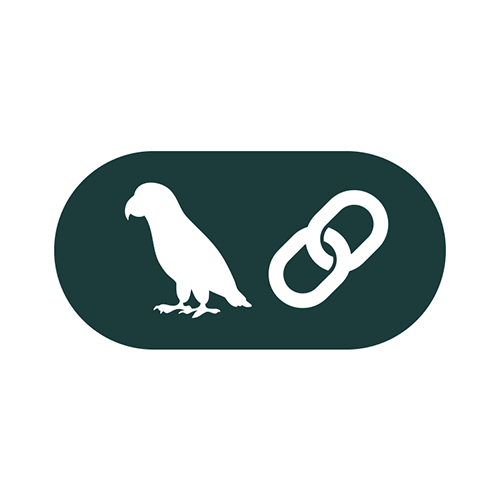
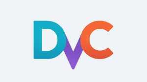

<h1 align="center">Hi 👋, I'm Md Rezanur Islam</h1>
<h3 align="center">Data Scientist | ML Engineer | In-Vehicle Network Security Researcher</h3>

  

---

- 🔭 **Current Focus**:  
  I’m working on **Driving Sentiment Detection** to enhance vehicle safety and user experience.

- 🌱 **Learning Goals**:  
  Deep diving into **Large Language Models (LLM)**, **Langchain**, **Huggingface**, and **MLOps** to build scalable and efficient AI systems.

- 👯 **Collaboration Interests**:  
  Open to collaborations in **LLM projects**, **Generative AI applications**, and **MLOps workflows**.

- 🤝 **Key Skills Gained**:  
  - Building advanced **Generative AI applications** with Langchain and Huggingface.  
  - Designing **Retrieval-Augmented Generation (RAG)** pipelines for enhanced performance.  
  - Customizing and fine-tuning Huggingface models for domain-specific use cases.  
  - Deploying AI models using various strategies for scalability and reliability.  
  - Implementing **MLOps pipelines** for AI system deployment, monitoring, and optimization.  
  - Utilizing tools like **Docker**, **MLflow**, and **Jenkins** for continuous integration and delivery in AI workflows.  

- 📝 **Publications**:  
  Explore my research articles on [ResearchGate](https://www.researchgate.net/profile/Md-Islam-1381).

- 📫 **Contact Me**:  
  Feel free to reach out via **arupreza@sch.ac.kr** or **aruphimonix@gmail.com**.

---

<h3 align="left">🌐 Connect with Me:</h3>

  

---

<h3 align="left">🛠️ Languages and Tools:</h3>

#### **LLMs and AI Development**

 
  
   
  
  
  
  
  
  
  
  

#### **MLOps and Deployment Tools**

 
   
  
   
   
  
   
  
   

---

  
  

<h3 align="center">✨ "The best way to predict the future is to create it." ✨</h3>
